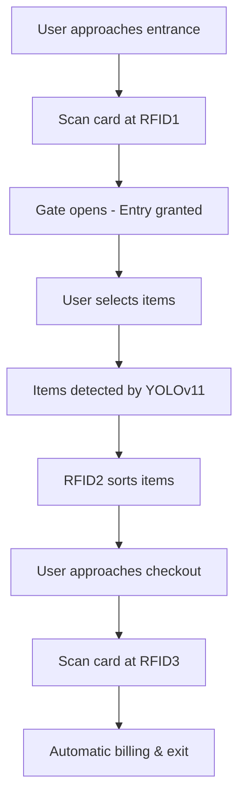

# AIOT Auto-checkout System


A comprehensive automated retail solution combining RFID technology, computer vision, and web interface for seamless shopping experience.


##  System Overview

This system integrates three main components to create a fully automated retail checkout experience:

- **Arduino-based RFID controllers** for access control and item management
- **YOLOv11 AI model** for object detection and recognition  
- **Web application** for system monitoring and management

## 📁 Project Structure

```
AIOT-Auto-checkout/
├── Arduino/
│   ├── RFID1.ino          # Entrance control system
│   ├── RFID2.ino          # Item sorting mechanism
│   └── RFID3.ino          # Billing system
├── Yolov11/
│   ├── yolo_detect.py     # Main detection script
│   ├── my_model.pt        # Trained model weights
│   └── [other AI files]   # Supporting AI model files
└── webapp/
    ├── app.py             # Flask web application
    └── [web files]        # Additional web application files
```

## 🔧 Hardware Components

### Arduino Controllers

#### RFID1.ino - Entrance Control System
- **Purpose**: Controls the main entrance gate
- **Hardware**: ESP32, RFID reader, servo motor
- **Function**: Authenticates user cards and operates entrance gate

#### RFID2.ino - Item Sorting Mechanism  
- **Purpose**: Manages item processing and sorting
- **Hardware**: ESP32, RFID reader, 2x servo motors
- **Functions**:
  - Controls singularity mechanism servo
  - Reads RFID tags on items
  - Operates rotation servo for item sorting

#### RFID3.ino - Billing System
- **Purpose**: Handles checkout and payment processing
- **Hardware**: ESP32, RFID reader
- **Function**: Processes user card for automatic transaction completion

### Required Hardware
- 3x ESP32 microcontrollers
- 3x RFID readers (RC522 recommended)
- 4x Servo motors
- USB webcam
- RFID cards and tags
- Mechanical components for gates and sorting mechanism

## 🤖 YOLOv11 AI Model Setup

### Prerequisites
- [Anaconda](https://www.anaconda.com/products/distribution) installed
- USB webcam connected

### Installation & Usage

1. **Create and activate virtual environment**:
```bash
conda create -n yolo-env1 python=3.8
conda activate yolo-env1
```

2. **Install dependencies**:
```bash
pip install ultralytics opencv-python numpy
```

3. **Navigate to model directory**:
```bash
cd path/to/Yolov11/
```

4. **Run object detection**:
```bash
python yolo_detect.py --model my_model.pt --source 0 --resolution 1280x720
```

### Additional Resources
📺 For detailed setup instructions, watch: [YOLOv11 Tutorial](your-tutorial-link-here)

## 🌐 Web Application Setup

### Prerequisites
- Python 3.7+ installed
- [Visual Studio Code](https://code.visualstudio.com/) (recommended)

### Installation & Usage

1. **Navigate to webapp directory**:
```bash
cd webapp/
```

2. **Install dependencies**:
```bash
pip install flask flask-socketio
```

3. **Run the application**:
```bash
python app.py
```

4. **Access the application**:
   - Open your browser and go to `http://localhost:5000`
   - Or Ctrl + Click on the localhost link in terminal

## 🔄 System Workflow



1. **Entry**: User scans card at entrance (RFID1) → Gate opens
2. **Shopping**: Items are automatically detected and sorted (RFID2 + YOLOv11)
3. **Checkout**: User scans card for automatic billing (RFID3)
4. **Monitoring**: Web application provides real-time system overview

## 🛠️ Setup Instructions

### Arduino Setup
1. Install [Arduino IDE](https://www.arduino.cc/en/software)
2. Add ESP32 board support
3. Install required libraries:
   - MFRC522 (for RFID)
   - Servo
   - WiFi
4. Upload respective `.ino` files to each ESP32

### Hardware Connections
| Component | ESP32 Pin | Notes |
|-----------|-----------|-------|
| RFID SDA | GPIO 21 | |
| RFID SCK | GPIO 18 | |
| RFID MOSI | GPIO 23 | |
| RFID MISO | GPIO 19 | |
| RFID RST | GPIO 22 | |
| Servo PWM | GPIO 2 | Adjust per design |

## 📋 Software Dependencies

### Python Packages
```bash
# For YOLOv11
ultralytics
opencv-python
numpy
torch
torchvision

# For Web Application  
flask
flask-socketio
```

### Arduino Libraries
- MFRC522
- ESP32Servo
- WiFi
- ArduinoJson

## 🚨 Troubleshooting

### Common Issues
- **RFID not reading**: Check wiring connections and power supply
- **Servo not moving**: Verify PWM pin assignments and power requirements
- **Camera not detected**: Ensure proper USB connection and permissions
- **Web app not loading**: Check if port 5000 is available

## 🤝 Contributing

1. Fork the repository
2. Create a feature branch (`git checkout -b feature/amazing-feature`)
3. Commit your changes (`git commit -m 'Add amazing feature'`)
4. Push to the branch (`git push origin feature/amazing-feature`)
5. Open a Pull Request

### Development Guidelines
- Test each component individually before integration
- Ensure all hardware connections are properly secured
- Document any hardware modifications
- Follow existing code style and structure


## 📞 Support

- 📧 **Issues**: Please use the [GitHub Issues](../../issues) page
- 📚 **Documentation**: Check individual component folders for detailed docs
- 🎥 **Video Tutorials**: [YOLOv11 Setup Guide](your-link-here)

## 🙏 Acknowledgments

- YOLOv11 team for the object detection framework
- Arduino community for hardware integration resources
- Contributors and testers who helped improve the system

## 📄 License

This project is licensed under the MIT License - see the [LICENSE](LICENSE) file for details.
---

**⚠️ Safety Notice**: Always follow proper electrical safety procedures when working with hardware components. Test each module individually before full system integration.


